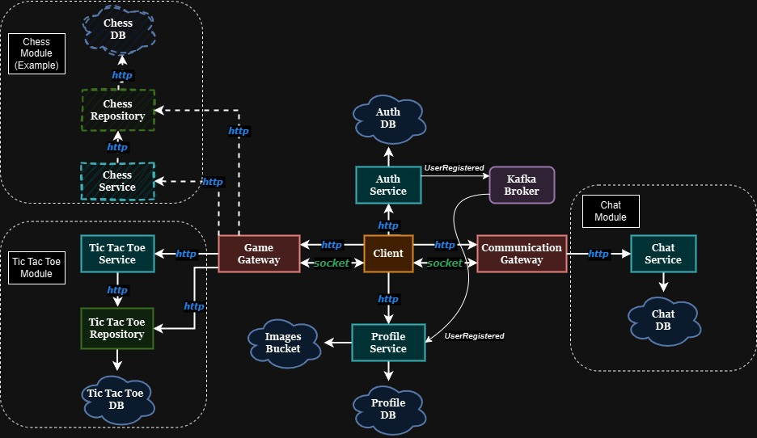
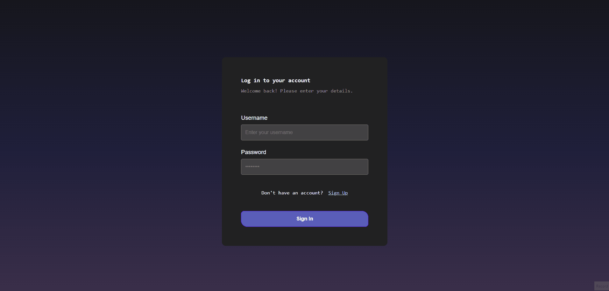

# PlayTalk - Microservices Project

## Table of Contents

1. [Introduction](#introduction)
2. [Getting Started](#getting-started)
   - [Prerequisites](#prerequisites)
   - [Installation](#installation)
   - [Running the Services](#running-the-services)
3. [Project Architecture](#project-architecture)
4. [Security and Protection](#security-and-protection)
5. [Microservices Overview](#microservices-overview)
   - [Auth Service](#auth-service)
   - [Chat Service](#chat-service)
   - [Game Service](#game-service)
   - [Communication Gateway Service](#communication-gateway-service)
6. [Technology Stack](#technology-stack)
7. [Environment Configuration](#environment-configuration)
8. [Usage](#usage)
   - [Authentication Flow](#authentication-flow)
   - [Chat Operations](#chat-operations)
   - [Game Management](#game-management)
9. [Testing](#testing)
10. [Folder Structure](#folder-structure)
11. [Known Issues](#known-issues)
12. [Future Enhancements](#future-enhancements)
13. [Contact Information](#contact-information)

## Introduction

PlayTalk is a showcase project that demonstrates a modern microservices architecture for a social communication platform. The project is currently in active development. The project allows users to interact in real-time through messaging and gaming features. PlayTalk is designed to showcase scalable, modular microservices, using a technology stack including Node.js, Docker, Redis, Kafka, and React.

The main features of PlayTalk include:

- **User Authentication**: Secure registration and login using the Auth Service.
- **Chat System**: One-on-one messaging, managed by the Chat Service.
- **Game Integration**: Support for real-time gaming between users, managed by the Game Service.
- **Communication Gateway**: A gateway to route requests between the various microservices.

PlayTalk's microservices are containerized using Docker, and the project includes CI integration for automated deployment to DockerHub. The goal of PlayTalk is to demonstrate clean microservices separation, communication, and an efficient use of modern web technologies.

## Getting Started

### Prerequisites

- **Docker**: Docker is required to run the microservices. Ensure that Docker is installed and running on your system.
- **Node.js**: To make development changes or run some tools locally, Node.js is recommended.

### Installation

First, clone the repository:

```
git clone https://github.com/Maksim1Korolev/PlayTalk.git
```

The necessary files to run the project are included within the repository. This includes the `docker-compose.yaml` file and a pre-configured `.env` file that contains all the environment variables required to run the services. Since this is a showcase project, there is no need for manual configuration.

Alternatively, you can manually place the `.env` and `docker-compose.yaml` files in any directory of your choice, navigate to that directory, and run the same command to start the services.

### Running the Services

To start the services, navigate to the project directory and run Docker Compose:

```
docker compose up
```

This command will pull all required images and start all services.

Once the services are up, the application will be accessible at:

- **Frontend**: [http://localhost](http://localhost)

## Project Architecture



The PlayTalk architecture is designed with modularity and resilience in mind. It consists of multiple microservices connected through two primary gateway services: the Game Gateway and the Communication Gateway. Each of these gateways is responsible for managing specific interactions in the system.

- **Sockets for Gateway Services**: The system maintains two distinct socket connections to handle different types of communication:

  - **Game Gateway Socket**: This socket is responsible for all game-related operations and connects the client to various game modules (e.g., Tic Tac Toe, Chess).
  - **Communication Gateway Socket**: This socket is dedicated to communication-related services, such as the chat module. In the future, additional communication modules could be added, such as notifications or user status updates.
  - **Online Status Management**: The user's online status is maintained based on both socket connections. A user is considered online if they are connected to at least one of the gateway sockets (either Game or Communication).

- **Service Decoupling**: The architecture is designed for high resilience. The client has multiple points for accessing the list of users. It tries to retrieve user data from the **Profile Service** first, including avatars. If the **Profile Service** is unavailable, it then queries the **Auth Service** for basic user data. If both services are down, the client still obtains a list of online users from the gateway services. This ensures the application remains functional even when some services are temporarily unavailable.

- **Independent Module Functionality**: Each module (e.g., game or chat) is designed to operate independently, ensuring that failures in one area do not affect other parts of the system.

- **Service Databases and Caching**: Each microservice that needs a database has its own dedicated database. Additionally, all cache data is managed through **Redis**. Cached data is retrieved from Redis before making a database call, which helps to improve the overall performance of the system.

- **User Registration Event Handling**: Kafka is used as a message broker to handle the user registration events. When a user registers via the **Auth Service**, an event is published to Kafka, which is then consumed by the **Profile Service** to create a corresponding user profile. This decoupling allows the **Auth Service** to focus solely on authentication tasks while other responsibilities, like profile creation, are handled asynchronously by other services. This event-driven approach improves scalability and reduces the direct dependencies between services.

This architecture allows PlayTalk to be scalable and resilient, providing a smooth user experience even in the face of partial system failures.

## Security and Protection

To ensure secure communication between users and services, PlayTalk uses several mechanisms for authentication and inter-service security.

- **JWT Authentication**: JSON Web Tokens (JWT) are used to authenticate users. The token is included in the headers of HTTP requests and also during socket handshakes.

  - The **JWT Token** is verified in middleware before allowing access to protected routes or services. For socket handshakes, the token is also decoded to identify and authorize the user.
  - After successfully verifying the JWT token, the username is extracted and stored in the request. This username is then used to make requests to other services, ensuring that users can only access the data they are authorized to see.
  - Example Middleware for Socket Authentication:

    ```javascript
    export const socketAuthMiddleware = (req, res, next) => {
      const isHandshake = req._query.sid === undefined;

      if (!isHandshake) {
        return next();
      }

      const header = req.headers["authorization"];

      if (!header || !header.startsWith("Bearer ")) {
        return next(new Error("Invalid or missing token"));
      }

      const token = header.substring(7);

      jwt.verify(token, process.env.JWT_SECRET, (err, decoded) => {
        if (err) {
          return next(new Error("Invalid token"));
        }

        req.user = { id: decoded.userId, username: decoded.username };
        next();
      });
    };
    ```

- **Service-to-Service Authentication**: When services within PlayTalk need to communicate with each other, a special header is used to identify the requesting service.

  - **Service Whitelist**: A whitelist of allowed services ensures that only trusted services can make requests internally. Each service includes a specific header (`INTERNAL_SERVICE_HEADER`) with its name, which is then checked by the receiving service to determine if the request is allowed.
  - Example Middleware for Whitelisting Services:

    ```javascript
    const WHITELISTED_SERVICES = ["communication_gateway_service"];

    export const serviceWhitelistMiddleware = (req, res, next) => {
      const serviceHeaderKey = process.env.INTERNAL_SERVICE_HEADER;
      const serviceHeader = req.headers[serviceHeaderKey];

      if (WHITELISTED_SERVICES.includes(serviceHeader)) {
        next();
      } else {
        res
          .status(403)
          .json({ message: "Access forbidden: Service not allowed" });
      }
    };
    ```

These security measures help ensure that both user interactions and internal service communications are secure and properly authenticated, protecting the system from unauthorized access.

## Microservices Overview

### Auth Service

The Auth Service is responsible for creating JWT tokens, handling user login, and managing user registration. Its database stores information that is related to authentication only. It includes rate limiting to prevent abuse and ensure fair usage of authentication endpoints.

### Profile Service

The Profile Service is connected to an AWS S3 bucket that stores user images, such as profile avatars. On request, the Profile Service generates a signed URL for clients to securely upload or retrieve images. In addition to managing user avatars, the Profile Service can also store general profile information, including email, real name, status, and other user-related details.

### Communication Gateway Service

The Communication Gateway Service manages interactions like chat, user status updates, and potential future features such as notifications. It also provides online management for all users, tracking their status through socket connections. It connects clients to these services using sockets for real-time responsiveness, ensuring efficient communication across the platform.

### Chat Service

The Chat Service is responsible for managing message histories and the logic related to user messaging. It includes a message buffer to ease the load on the database by temporarily storing frequently updating data, thereby improving efficiency and reducing database pressure.

### Game Gateway Service

The Game Gateway Service is similar to the Communication Gateway Service but focuses on managing game-related logic. It handles game interactions, such as making moves, matchmaking, and maintaining a list of active games using Redis for efficient real-time operations. It also manages online status for users through socket connections, supporting real-time game interactions.

### Tic Tac Toe Module

The Tic Tac Toe Module consists of two distinct parts: the Tic Tac Toe Service (built in .NET) and the Tic Tac Toe Repository.

- **Tic Tac Toe Service**: This service, built using .NET, is responsible for managing the core game logic, such as validating moves, determining winners, and ensuring fair gameplay between players. The Tic Tac Toe Service interacts with the repository only to send necessary updates about game progress.
- **Tic Tac Toe Repository**: The repository handles data storage and retrieval for the Tic Tac Toe game. It stores all game states and player data, which can be accessed independently of the game logic. This separation allows for efficient data access when users want to view game histories or player statistics without engaging the Tic Tac Toe Service, thereby reducing unnecessary load on the game logic component.

## Technology Stack

- **React**: Frontend library for building the user interface.
- **Redux**: State management for managing the client-side state efficiently.
- **Node.js** and **Express**: Backend service and framework for handling requests and business logic.
- **.NET**: Used for building the Tic Tac Toe Service to handle core game logic.
- **Redis**: Used for caching and real-time data operations.
- **MongoDB**: Database for storing user data, games data, and chat history through mongoose.
- **Socket.io**: Real-time, bi-directional communication between the client and server for chat and game events.
- **Kafka**: Message broker used for inter-service communication, specifically between auth and profile services.
- **Jest**: Testing framework for ensuring code reliability through unit and integration tests.

## Environment Configuration

All environment variables are pre-configured in the system, except for AWS keys. The AWS keys are added to the build process as arguments through CI, sourced from GitHub secrets.

## Usage

### Authentication Flow



### Chat Operations


### Game Management


## Testing

PlayTalk uses **Jest** for unit tests on the Node.js servers. Unit tests help ensure the reliability of individual functions and components. Currently, there are no integration tests implemented.

## Folder Structure

The PlayTalk project is organized into multiple directories that promote modularity and scalability:

### Client

The **client** folder contains the entire frontend application, built with **React** and **Redux**. It follows a future-proof, feature-sliced design pattern for scalability and maintainability. This structure helps to manage complex UI requirements and promotes reusability across different parts of the app.

- **app**: The entry point for the application, handling the global app configurations.
- **entities**: Represents the core business logic and data models of the application, such as user and game entities.
- **public, assets, images**: Contains static files like icons, game images, and profile pictures.
- **features, widgets, pages**: Organized to enhance maintainability and promote separation of concerns. Pages represent higher-level screens, while features and widgets are reusable components for different parts of the UI.
- **shared**: Contains shared components, common hooks, and global styles that are reused across the application.

### Server

The **server** folder contains all backend code, with each microservice represented by its own directory. The server code is structured to maintain clear separation between different functionalities:

- **auth, profile, chat, tic-tac-toe**: Each of these folders represents a standalone microservice.

  - **auth**: Manages user authentication, including registration and login.
  - **profile**: Manages user profile data, including avatar management via AWS S3.
  - **chat**: Handles user messaging and maintains message histories.
  - **tic-tac-toe**: Contains both the **Tic Tac Toe Service** (written in .NET) for game logic and the **Tic Tac Toe Repository** for data storage.

- **communication** and **game**: These folders represent larger modules that include their respective gateway services in "core" folder.

  - **communication-gateway-service**: Acts as the gateway for communication-related features like chat.
  - **game-gateway-service**: Handles game-related interactions, including coordinating game services and managing player connections.

This structure keeps the code organized and modular, allowing developers to easily make changes to individual features or microservices without affecting the entire system.

## Known Issues

There may be some issues as the project is still in active development. You can open the `.todos` file in the main project folder to see the current status of features in progress and areas under active work.

## Future Enhancements

Planned features or improvements for the project include:

- **User Search**: Implement a search feature to easily find users.
- **Group Chats**: Add support for group chat functionality.
- **Friends**: Add a friend system to allow users to add and manage friends.
- **Turns History and More Stats on Tic Tac Toe Server**: Provide detailed turn history and game statistics for the Tic Tac Toe service.

For more features in progress or planned enhancements, please refer to the `.todos` file in the main project folder.

## Contact Information

For questions or collaboration opportunities, you can reach out to the developers involved in the PlayTalk project:

- [Maksim Korolev](https://github.com/Maksim1Korolev)
- [Mikhail Nakhimson](https://github.com/Dreamaty)
